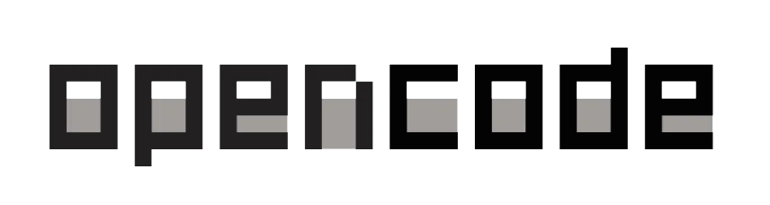
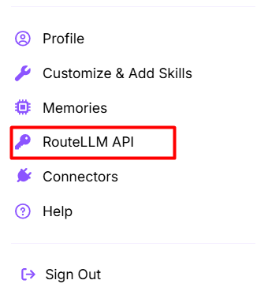
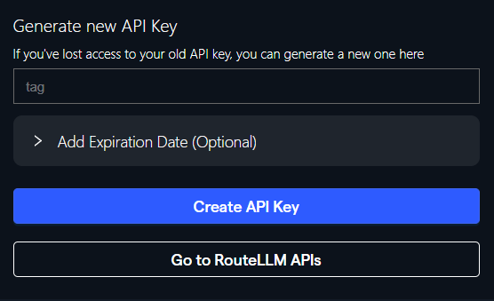
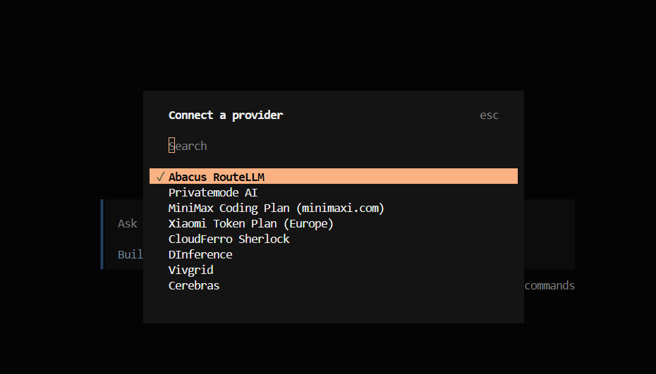
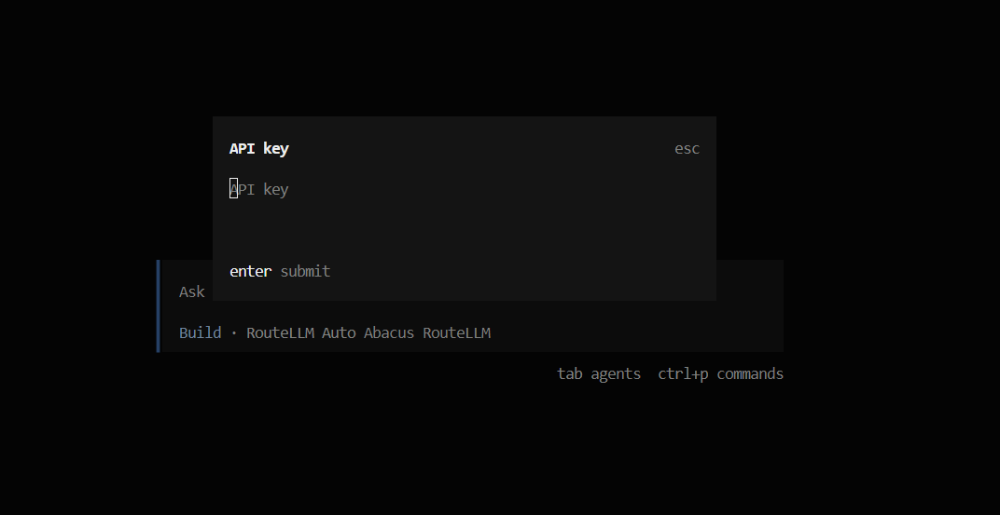
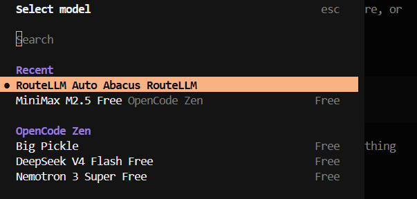

<p align="center"></p>

<h4 align="right">Apr 26</h4>

<p>
  
  

</p>
<h1 align="center"> OpenCode </h1> 
<br>
OpenCode es una herramienta tipo CLI/TUI (Command Line Interface /Text User Interface) para usar modelos de IA desde la terminal, enfocada en desarrollo. Permite;

* Trabajar con IA sin navegador, directo en terminal
* Manejar sesiones, agentes y contexto de código
* Automatizar tareas (generar código, refactorizar, analizar repositorios)
* Definir agentes personalizados con reglas propias

nota: No es un modelo de IA.
Es un orquestador/interfaz para usar varios modelos de forma más controlada y productiva, especialmente en workflows técnicos

***OpenCode*** está diseñado específicamente para la programación y el desarrollo de software. Es un agente de codificación. Se enfoca en ayudarte a entender, escribir, depurar y ejecutar código dentro de repositorios reales.Se usa principalmente a través de la terminal (CLI/TUI), aplicaciones de escritorio o extensiones de IDE como VS Code.Funciona bajo un esquema de "chat + herramientas", donde tú diriges la tarea y él propone ediciones. Se integra profundamente con herramientas de desarrollo como el LSP (Language Server Protocol) para refactorizar código y GitHub Actions.

OpenCode es similiar a ```Claude Code (Anthropic)``` pero de codigo abierto, mientras que Claude Code es cerrado y es la herramienta oficial optimizada específicamente para los modelos de la familia Claude (como Sonnet 3.5 o 4).

<br>


# Table of contents
- [Table of contents](#table-of-contents)
- [Install](#install)
- [Run](#run)
- [OpenCode - Comandos](#opencode---comandos)
  - [Tabla de Comandos](#tabla-de-comandos)
  - [Gestión de agentes](#gestión-de-agentes)
  - [Sesiones](#sesiones)
  - [Conexión / autenticación](#conexión--autenticación)
  - [Import / Export](#import--export)
  - [Servidor / remoto](#servidor--remoto)
  - [Estadísticas](#estadísticas)
  - [Comandos TUI (slash)](#comandos-tui-slash)
  - [Comandos personalizados](#comandos-personalizados)
- [Terminales Compatibles](#terminales-compatibles)
- [RouteLLM de Abacus en Opencode](#routellm-de-abacus-en-opencode)
- [Generar API key](#generar-api-key)
- [Seleccionar el Proveedor de AI (por interfaz de OpenCode)](#seleccionar-el-proveedor-de-ai-por-interfaz-de-opencode)
- [Contexto en la AI (Agents.md)](#contexto-en-la-ai-agentsmd)
  - [Contexto](#contexto)

<br>

# Install
Desde pagina oficial: https://opencode.ai/
```bash
npm i -g opencode-ai
```

# Run
Desde terminal
```bash
opencode
```
<br>

# OpenCode - Comandos

> :memo: **Note:** Cambiar agente entre Build / Plan (con tecla Tabulacion [TAB]) 
- Build - Agente primario por defecto con todas las herramientas habilitadas
- Plan - Agente para planificación y análisis sin hacer cambios

> :bulb: **Tip:** Usar ```@``` para realizar una búsqueda aproximada de archivos dentro del proyecto. ejemplo: ¿Cómo se maneja la autenticación en ***@packages/functions/src/api/index.ts***

> :bulb: **Tip:** Arrastre y suelte imágenes en la terminal para agregarlas al mensaje.

<br>

## Tabla de Comandos

| Comando | Tipo | Descripción |
|--------|------|------------|
| opencode | CLI | Inicia la interfaz TUI interactiva |
| opencode run "<prompt>" | CLI | Ejecuta una tarea y sale |
| opencode --continue | CLI | Continúa la última sesión |
| opencode --session <id> | CLI | Continúa una sesión específica |
| opencode --fork | CLI | Duplica sesión al continuar |
| opencode --model <provider/model> | CLI | Selecciona modelo |
| opencode --agent <name> | CLI | Usa un agente específico |

---

## Gestión de agentes

| Comando | Tipo | Descripción |
|--------|------|------------|
| opencode agent | CLI | Gestión de agentes |
| opencode agent create | CLI | Crear agente personalizado |
| opencode agent list | CLI | Listar agentes disponibles |

---

## Sesiones

| Comando | Tipo | Descripción |
|--------|------|------------|
| opencode session | CLI | Gestión de sesiones |
| opencode session list | CLI | Listar sesiones |
| /sessions | TUI | Ver sesiones desde la interfaz |

---

## Conexión / autenticación

| Comando | Tipo | Descripción |
|--------|------|------------|
| opencode auth | CLI | Gestión de credenciales |
| opencode auth login | CLI | Agregar API keys |
| /connect | TUI | Añadir proveedor/API keys (equivalente práctico) |

---

## Import / Export

| Comando | Tipo | Descripción |
|--------|------|------------|
| opencode export [id] | CLI | Exportar sesión a JSON |
| opencode import <file/url> | CLI | Importar sesión |
| /export | TUI | Exportar conversación |

---

## Servidor / remoto

| Comando | Tipo | Descripción |
|--------|------|------------|
| opencode serve | CLI | Servidor API sin interfaz |
| opencode web | CLI | Interfaz web |
| opencode attach <url> | CLI | Conectar a backend remoto |

---

## Estadísticas

| Comando | Tipo | Descripción |
|--------|------|------------|
| opencode stats | CLI | Ver uso de tokens y costos |

---

## Comandos TUI (slash)

| Comando | Tipo | Descripción |
|--------|------|------------|
| /init | TUI | Genera `AGENTS.md` |
| /help | TUI | Ayuda |
| /undo | TUI | Deshacer |
| /redo | TUI | Rehacer |
| /share | TUI | Compartir sesión |
| /exit | TUI | Salir |
| /<custom> | TUI | Ejecuta comandos personalizados definidos por el usuario |

---

## Comandos personalizados

| Comando | Tipo | Descripción |
|--------|------|------------|
| /my-command | TUI | Ejecuta un comando definido en `.opencode/command/*.md` |

<br>

# Terminales Compatibles
* ```WSL + Windows``` 
> :warning: **Warning:** Se debe instalar de nuevo OpenCode, porque se instaló en Windows, no dentro de WSL. Son dos sistemas de archivos y entornos separados

> :warning: **Warning:** Se debe instalar nvm (no tocar el npm del sistema)

* ```Windows Terminal + CMD```
* ```VS Code terminal integrado```

<br>

# RouteLLM de Abacus en Opencode
Configuración Global

Create opencode.json en 
```bash
C:\Users\<USUARIO>\.config\opencode\opencode.json
```

En terminal:
```bash
cd .config
nano opencode.json
```

opencode.json
```Json
{
  "$schema": "https://opencode.ai/config.json",

  // Provider: Abacus RouteLLM (compatible con OpenAI)
  "provider": {
    "abacus": {
      "npm": "@ai-sdk/openai-compatible",
      "name": "Abacus RouteLLM",
      "options": {
        "baseURL": "https://routellm.abacus.ai/v1",
        "apiKey": "{env:ABACUS_API_KEY}"
      },
      "models": {
        // Auto-routing (recomendado para uso general)
        "route-llm": {
          "name": "RouteLLM Auto"
        },
        // OpenAI via Abacus
        "gpt-5.4": { "name": "GPT-5.4" },
        "gpt-5.4-mini": { "name": "GPT-5.4 Mini" },
        "gpt-5.3-codex": { "name": "GPT-5.3 Codex" },
        "gpt-4.1": { "name": "GPT-4.1" },
        // Anthropic via Abacus
        "claude-sonnet-4-6": { "name": "Claude Sonnet 4.6" },
        "claude-opus-4-7": { "name": "Claude Opus 4.7" },
        "claude-haiku-4-5": { "name": "Claude Haiku 4.5" },
        // Google via Abacus
        "gemini-3.1-pro": { "name": "Gemini 3.1 Pro" },
        "gemini-2.5-flash": { "name": "Gemini 2.5 Flash" },
        // Coding / embedded
        "qwen3-coder": { "name": "Qwen3 Coder" },
        "qwen3-235b-a22b": { "name": "Qwen3 235B" },
        "deepseek-v3.2": { "name": "DeepSeek V3.2" },
        "deepseek-R1": { "name": "DeepSeek R1" },
        // Abacus propios
        "abacus-smaug2": { "name": "Abacus Smaug2" },
        "abacus-dracarys": { "name": "Abacus Dracarys" }
      }
    }
  },

  // Modelo por defecto (auto-routing)
  "model": "abacus/route-llm",

  // Modelo ligero para tareas menores (títulos de sesión, etc.)
  "small_model": "abacus/claude-haiku-4-5",

  // Permisos: pide confirmación antes de ejecutar bash o editar archivos
  // Recomendado para proyectos de firmware/embedded
  "permission": {
    "bash": "ask",
    "edit": "ask"
  },

  // Compactación de contexto automática
  "compaction": {
    "auto": true,
    "prune": true
  },

  // Ignorar carpetas de build en el watcher
  "watcher": {
    "ignore": [
      ".pio/**",
      ".git/**",
      "build/**",
      "dist/**",
      "__pycache__/**",
      "*.o",
      "*.elf",
      "*.bin"
    ]
  },

  // Actualizaciones automáticas
  "autoupdate": true
}
```

<br>

# Generar API key

<p align="center"></p>
<p align="center"></p>

<br>

# Seleccionar el Proveedor de AI (por interfaz de OpenCode)

```bash
opencode
/connect
```

<p align="center"></p>

Introducimos el API key
<p align="center"></p>

verificamos los modelos
```bash
/models
```

<p align="center"></p>

ready!!!

<br>

# Contexto en la AI (Agents.md)
```bash
~/.config/opencode/AGENTS.md     ← global (todos tus proyectos)
        +
~/proyectos/esp32/AGENTS.md      ← específico del proyecto
        +
~/proyectos/esp32/src/AGENTS.md  ← específico de una subcarpeta (opcional)
```
El más específico no reemplaza al global, se suma. Si hay conflicto, gana el más específico.

##  Contexto
Agregar la carpeta ```context``` dentro del proyecto

<br>


---

<div>
  <p>
     Copyright &nbsp;&copy; 2023 Instinto Digital <a href="https://carjavi.github.io/" title="carjavi.github">carjavi</a>
  </p>
</div>

<p align="center">
    <a href="https://instintodigital.net/" target="_blank"></a>
</p>


